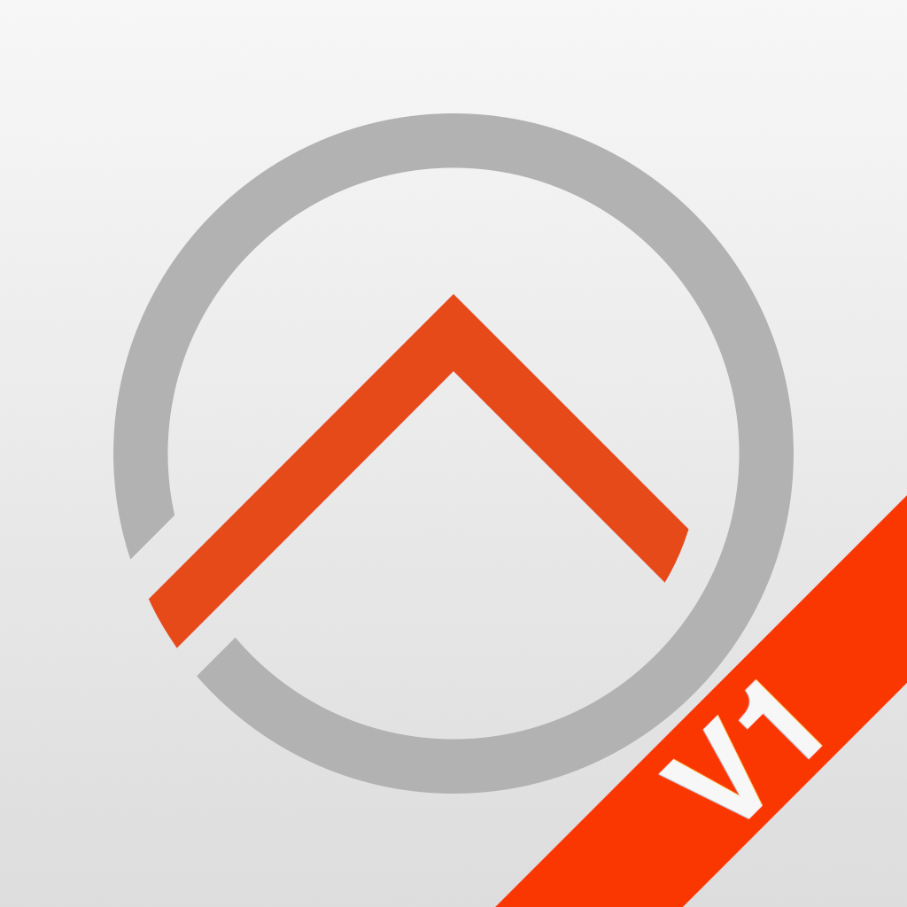

    
     
    <b>openHAB client for iOS</b>

## Introduction

This is the IOS native client for openHAB.

## Download

### openHAB (Current)

This is the primary openHAB app which contains the latest features and is updated regularly. This includes Apple Watch support, enhanced notifications, widgets and more.
Requires at least iOS 16 and openHAB 2.x and later.

(Official App Store Link Coming Soon)

Beta releases are available on [TestFlight](https://testflight.apple.com/join/0uFYONeF).

### openHAB V1 (Legacy)

This is the legacy app for users on iOS 15 or earlier as well as openHAB system 1.x and later (tested to at least openHAB 4).
This app only receives security updates and minor fixes and is not intended for most users. 

Beta releases are available on [TestFlight](https://testflight.apple.com/join/563WBakc).

## Features
* Control your openHAB server directly and through a [openHAB Cloud instance](https://github.com/openhab/openhab-cloud)
* [Enhanced push notification](#push-notifications) from openHAB Cloud and the openHAB cloud binding 
* [Apple Watch](#apple-watch-configuration) companion app
* [Widgets](#widgets) (coming soon!)

## App Configuration

### Connection Settings
The app will try and connect using the Local URL as the primary connection, and if that fails or is not reachable, falls back to the local URL.  

### Demo Mode
This sets up the app to use the openHAB demo server and can be used to experience the app without needing to install openHAB.

#### Local URL
This is the primary connection to your openHAB instance, a fully qualified URL with a IP or host is required.

Example:
`https://openhab.local:8443`

#### Remote URL
This is the secondary connection to your openHAB instance, a fully qualified URL with a IP or host is required.
If using the openHAB cloud service, leave this as the default setting of `https://myopenhab.org`.
When set to the public cloud, the app will also register for push notifications (as long as credentials are correct)

Example:
`https://myopenhab.org`

### Username / Password
This will be sent if the local or remote server challenges for authentication, or if "Always Send Credentials" is checked on.
If using the openHAB cloud, these should be set to those login credentials.

### Application Settings

### Certificates
Provide a client side certificate in P12 format for use in client side authentication setups.

To install a client certificate, rename the certificate with the extension `.ohp12`, then send it to your iOS device (airdrop, icloud, dropbox, etc..), then open/save and select `openHAB` from the "Open In" menu (you may need to select "More..." to see all apps).

To delete a certificate, swipe left on the certificate name in the certificate menu 

If using openssl v3 make sure to add `-legacy -certpbe pbeWithSHA1And40BitRC2-CBC` to the pk12 export command
See https://github.com/openssl/openssl/issues/19871 

### Idle Timeout
Useful for wall or fixed installations, will disable the Idle screen timeout.

### Crash Reporting
Sends crash reports to Google / Firebase.

### Main UI Settings

#### WebRTC
Allows audio and video communications in the Main UI for views and widgets that require it.

#### Default Path
Allows the user to enter a path to act as the starting point when the Main UI is loaded.
Clicking the "+" button will prompt to enter the current path the of Main UI view.

#### Clear Cache
Clears the Main UI web cache.

### Sitemap Settings

#### Realtime Sliders
Allows sitemap sliders to send changes as the control is sliding in realtime.

### Image Cache
Clears the sitemap cached images.

### Icon Type
Select which type of icon the sitemap view will attempt to load for icons.

### Sitemap Sorting
Sort order when presenting multiple sitemaps for selection.

## Apple Watch Configuration
The Apple watch requires a sitemap with the name `watch.sitemap`. 
Note that some advanced sitemap features may not be supported on the Apple watch and its recommended to keep this sitemap simple and appropriate for interaction on a small display.

When using the Watch app, slide left to bring up the configuration view and select "sync" to ensure the local, remote and username/password configurations are synced to the watch.

## Main UI and Sitemap Usage

Clicking "Home" will navigate to the Main UI from the user's openHAB system.  Clicking this when the Main UI is already visible will force a reload the Main UI.

Tiles are the alternative UIs installed on a user's system and will be opened in an embedded browser.

Sitemaps show the available sitemaps on the users system.  Selecting a sitemap will present the native sitemap renderer view.

Notifications is a list of push notification retrieved from the openHAB cloud (if configured).

Settings opens the application settings view.

The app will persist the last primary view opened (Main UI or Sitemaps) when the app is opened or restarted.

## Push Notifications

The [openHAB Cloud Connector](https://next.openhab.org/addons/integrations/openhabcloud/)  allows users to send push notifications mobile devices registered with an [openHAB Cloud instance](https://github.com/openhab/openhab-cloud) such as [myopenHAB.org](https://www.myopenhab.org).

Push Notifications on iOS support:
- Title and Body text
- Image and Video Attachments
- Collapsible / Updated Notifications
- Removing notifications
- Up to 3 action buttons (long press notification)

See [Cloud notification actions](https://next.openhab.org/addons/integrations/openhabcloud/#cloud-notification-actions) for a full list of notification options.

## Widgets

Coming soon !

## Setting up development environment

If you want to contribute to the iOS application we are here to help you to set up
development environment. 
openHAB iOS app is developed using Xcode and the standard iOS SDK from Apple.
The iOS application is based on the iOS 16 and watchOS 8 SDK and makes uses of several Swift packages.

To start developing you need an [Apple Developer](https://developer.apple.com/devcenter/ios/index.action) account.

- Download and install [Xcode](https://developer.apple.com/xcode/downloads/)
- Check out the latest iOS application code from GitHub
- Open the project workspace openHAB.xcworkspace

You are ready to contribute!

Before producing any amount of code please have a look at the [contribution guidelines](https://github.com/openhab/openhab.ios/blob/master/CONTRIBUTING.md).

And also please support with the localization of openhab-ios:

## Trademark Disclaimer

Product names, logos, brands and other trademarks referred to within the openHAB website are the
property of their respective trademark holders. These trademark holders are not affiliated with
openHAB or our website. They do not sponsor or endorse our materials.

Apple, the Apple logo, iPhone, and iPad are trademarks of Apple Inc., registered in the U.S. and other countries and regions. App Store is a service mark of Apple Inc.
