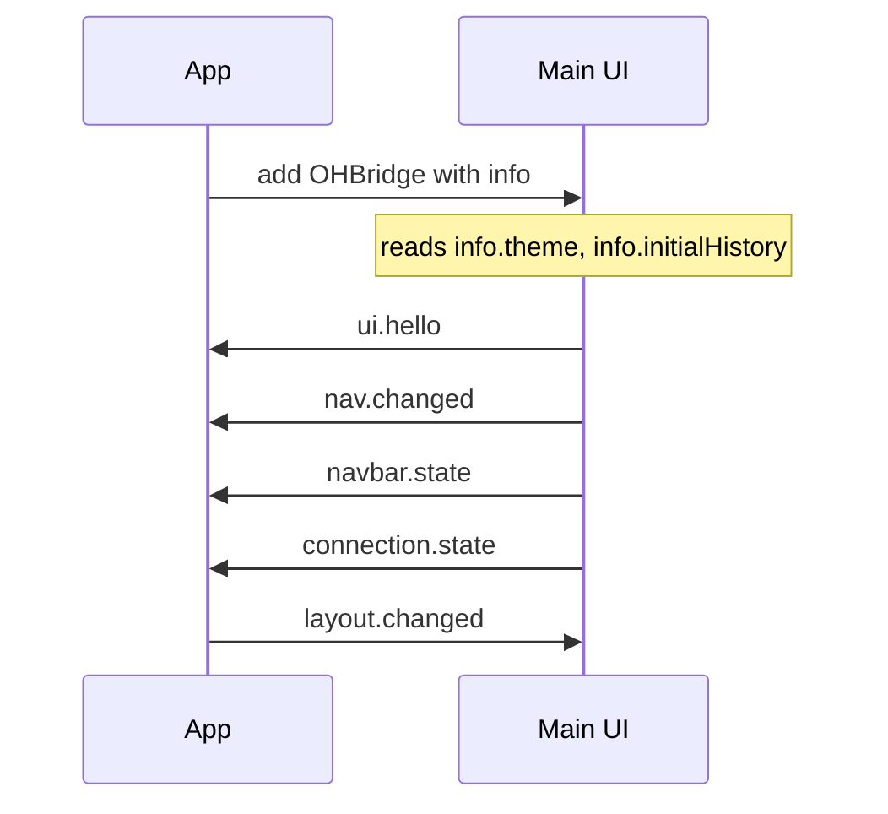
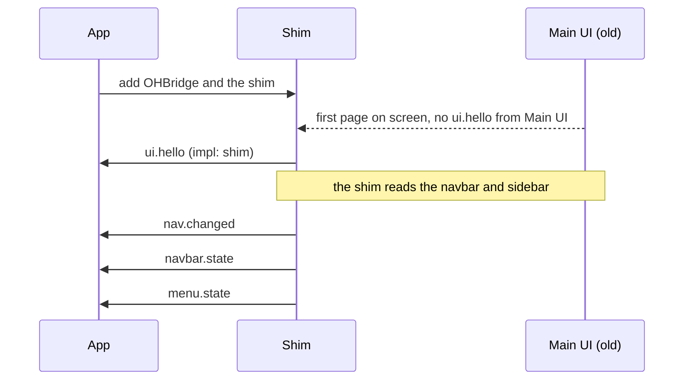
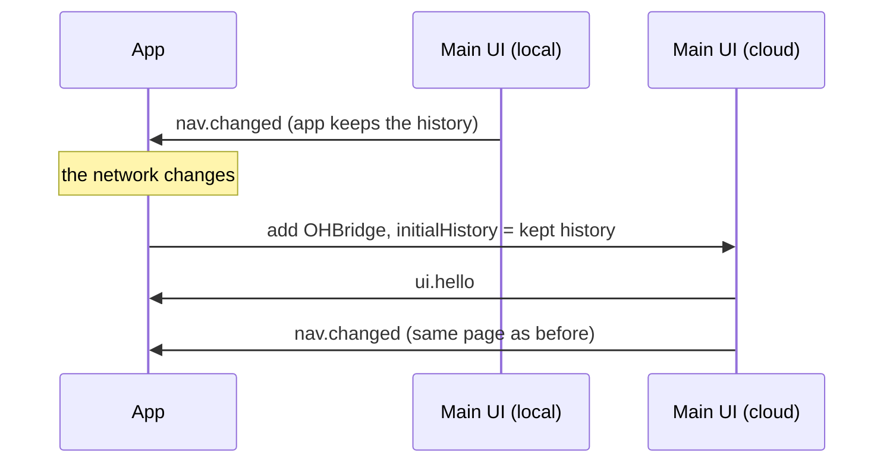

# Main UI bridge

How Main UI and the openHAB iOS and Android apps talk to each other. The message types are
defined in [`protocol.d.ts`](protocol.d.ts).

In this document, the **app** is the iOS or Android app, and the **page** is whatever is loaded
in the app's web view, usually Main UI.

## Why

Today the iOS app reaches into Main UI's page to change it: it reads the page's HTML to copy
the navbar and menu, rewrites styles, and calls `window.MainUI.handleCommand`. Every Main UI
change can break it. Main UI also has a small set of hooks for the apps (`window.OHApp`), but
they cover only a few things.

The bridge replaces both with one set of messages:

- **The app asks, Main UI decides.** The app says what it can do ("I draw the top bar", "put
  the user back on these pages"). Main UI does it and tells the app what it did. The app never
  reads Main UI's HTML.
- **One protocol for both apps.**
- **Older Main UI versions still work.** The app adds a small script to the page (the *shim*)
  that sends and answers the same messages on Main UI's behalf.

## How messages travel

The app puts an object called `OHBridge` on the page before any of the page's own scripts run.

| | Page → app | App → page |
|---|---|---|
| iOS | `OHBridge.postMessage(json)`, which forwards to the `OHBridge` message handler | The app calls `OHBridge.onmessage({ data: json })` |
| Android | `OHBridge.postMessage(json)`, from `WebViewCompat.addWebMessageListener` | The listener's reply object, which calls `OHBridge.onmessage` |

- Every message is a JSON string: `{ v: 1, type, id?, replyTo?, payload }`.
- `OHBridge.info` holds what Main UI needs before it draws anything: the theme, which parts the
  app takes over, the pages to put back, and the space the app's bar covers. Main UI reads it at
  startup, where it reads `OHApp` today.
- The app only listens to the page itself (not frames inside it), and only when the page comes
  from the server the app is connected to.
- Android has not been tried yet. `addWebMessageListener` creates the `OHBridge` object, and
  `addDocumentStartJavaScript` would add `info` to it. If that object can't take an extra
  property, `info` moves to its own global, `window.OHBridgeInfo`.

## What happens when a page loads

These steps run on every full page load: app start, reconnect, reload, switching between local
and cloud. Moving between pages inside Main UI doesn't reload the page.

1. The page starts loading. The app clears its top bar and menu and shows its loading screen.
2. Before any page script runs, the app adds `OHBridge` with `info`, for example
   `features: ['navbar', 'menu', 'routeRestore']`.
3. The first thing Main UI's code does is set `OHBridge.onmessage`. Until Main UI can navigate,
   it answers the app with `not_ready`.
4. Main UI starts from `info`. It decides then what to hand over to the app, so its first
   drawing is already right: no navbar or sidebar of its own if the app shows them, already on
   the right page, already clear of the app's bar.
5. When the first page is on screen, Main UI sends `ui.hello`, then `nav.changed`,
   `navbar.state` and `menu.state`. The app hides its loading screen and draws its bar and menu.
6. From then on, messages go both ways as things change.

The app never waits for the page to draw and then changes it. Main UI draws the right thing the
first time, from `info`.

New fields and messages can be added without changing `v: 1`. Each side ignores what it
doesn't know.

## Replies and retries

- **The page answers every message from the app.** Each one has an `id`, and the page replies
  with `{ ok: true }` or `{ ok: false, error: { code } }`.
- **The app doesn't answer the page's updates** (`navbar.state` and the like). It only answers
  requests, which carry an `id`. The one request today is `auth.getCredentials`.
- **Error codes:**

| Code | Meaning | App tries again? |
|---|---|---|
| `not_ready` | Main UI is up but can't act yet | Yes |
| `unknown_type` | The page doesn't know this message | No |
| `not_allowed` | Not possible right now, e.g. a dialog is open | No |
| `not_found` | The page or button it names isn't there any more | No |
| `failed` | It went wrong | No |

- **Messages wait for `ui.hello`.** Opening the app from a notification can mean finding a
  connection and loading Main UI first, which takes longer than any retry. So the app holds its
  messages until the page has said hello. When a new page starts loading, anything not yet
  answered waits again. A page that isn't Main UI only gets `layout.changed` and `ui.reload`;
  navigation waits for the next Main UI page. Anything still waiting after 30 seconds is
  dropped, so a command can't run long after the user has moved on.
- **Then retries.** If the answer is `not_ready`, or nothing comes back in 750 ms, the app
  sends again: up to 6 times, 300 ms apart, then it gives up and logs it. A newer message of
  the same type replaces an older one still waiting, so the user's last tap wins.
- **Tiles don't get the bridge.** A tile can be any website, so the app loads it without
  `OHBridge`.

## Messages

### `OHBridge.info` (set before the page starts)

| Field | What it's for |
|---|---|
| `protocol`, `platform`, `appVersion` | Which app this is and which version of the protocol it speaks. |
| `features` | What the app offers to take over. Main UI says which ones it took in `ui.hello`. |
| `theme`, `darkMode` | Theme to start with if the user hasn't picked one in Main UI. |
| `initialHistory`, `initialProps` | Pages to put back, oldest first, and what each was opened with (`deep`, `defineVars`). Main UI opens the last one, with the others behind it for Back. |
| `layout` | How much of the page the app's bars cover, so Main UI leaves room from the start. |

`features` can hold:

- `navbar`: the app draws the top bar. Main UI hides its own and sends `navbar.state`.
- `menu`: the app shows Main UI's sidebar in its own menu. Main UI hides its sidebar and sends
  `menu.state`.
- `routeRestore`: the app remembers where the user was and passes it back in `initialHistory`.

### Page → app

| Message | Contents | What it's for |
|---|---|---|
| `ui.hello` | `impl`, `version?`, `accepted`, `features` | Sent once per page load, when the first page is on screen. Says whether this is Main UI (`mainui`), the shim (`shim`) or another page (`other`), and which of the app's offers Main UI took. |
| `connection.state` | `sseConnected` | Main UI's live updates from the server connected or dropped. The app shows or hides its "connecting" indicator. |
| `nav.changed` | `path`, `history`, `props?`, `modal` | Sent after every page change. The app keeps `history` to put the user back later, and knows when a popup is open. |
| `navbar.state` | `title`, `titleInContent`, `hidden`, `back`, `leading`, `trailing` | Everything the app needs to draw the top bar. Describes the bar in front: an open popup's bar wins over the page's. Sent again whenever it changes. |
| `menu.state` | `sections` | What Main UI's sidebar shows this user, for the app's menu. Sent again whenever it changes. |
| `auth.getCredentials` | — | Asks the app for the user name and password of a proxy in front of openHAB. Sent only when Main UI's first call to the server is refused (401). The app answers with `{ username, password }`, or `null` if it has none. Main UI keeps them in memory only. |
| `reply` | `ok`, `result` or `error` | The answer to a message from the app. |

### App → page

| Message | Contents | What it's for |
|---|---|---|
| `nav.navigate` | `path`, `history?` | Go to a page, from the app's menu or a notification. |
| `nav.back` | — | The app's back button was tapped. |
| `nav.openModal` | `kind`, `target` | Open a page or widget as a popup, popover or sheet, e.g. from a `ui:popup:…` notification. |
| `nav.closeModals` | — | Close any open popup, popover or sheet. |
| `navbar.activate` | `id` | A button in the app's top bar was tapped. Main UI does what that button does. |
| `menu.activate` | `id` | A menu entry with no `path` was tapped, e.g. "Unlock Administration". |
| `settings.changed` | `theme?`, `darkMode?` | The phone switched theme or dark mode while the page is open. |
| `layout.changed` | `insets`, `navbarHeight?` | The space the app's bars cover changed. Main UI moves its content to match. |
| `nav.getState` | — | Asks for the current page and history. |
| `ui.reload` | — | Reload Main UI. |
| `reply` | `ok`, `result` or `error` | The answer to a request from the page. |

## Examples

Messages are shown as objects here; on the wire each is a JSON string. App message ids start
with `h`, page ids with `w`. Some app messages below leave out their `id` to keep them short.

### 1. Starting up



What the app puts on the page:

```js
OHBridge.info = {
  protocol: 1,
  platform: 'ios',
  appVersion: '3.4.31',
  features: ['navbar', 'menu', 'routeRestore'],
  initialHistory: ['/', '/page/overview', '/page/kitchen'],
  layout: { insets: { top: 0, bottom: 34 }, navbarHeight: 44 }
}
```

Main UI starts on the Kitchen page, with Overview behind it, and reports back:

```json
{ "v": 1, "type": "ui.hello", "payload": {
    "protocol": 1, "impl": "mainui", "version": "5.1.0",
    "accepted": ["navbar", "menu", "routeRestore"],
    "features": ["navbar", "menu", "routeRestore", "layout"] } }

{ "v": 1, "type": "nav.changed", "payload": {
    "path": "/page/kitchen",
    "history": ["/", "/page/overview", "/page/kitchen"],
    "modal": false } }

{ "v": 1, "type": "navbar.state", "payload": {
    "title": "Kitchen", "titleInContent": false, "hidden": false,
    "back": { "label": "Overview" },
    "leading": [],
    "trailing": [ { "id": "7", "label": "Edit", "icon": { "name": "f7:pencil", "md": "material:edit" } } ] } }

{ "v": 1, "type": "connection.state", "payload": { "sseConnected": true } }
```

The app now shows "Kitchen" in its bar, with a back button and a pencil button, and hides its
"connecting" indicator.

### 2. Starting up with an older Main UI



From here on it works as in example 1. The shim only sees the icon for the theme on screen, so
it never sends `md`.

### 3. Tapping a button in the app's top bar

```json
{ "v": 1, "type": "navbar.activate", "id": "h12", "payload": { "id": "7" } }

{ "v": 1, "type": "reply", "replyTo": "h12", "payload": { "ok": true } }
```

Main UI opens the page editor, then sends the new `nav.changed` and `navbar.state` (title
"Edit Page", button "Save").

Back works the same way: the app sends `nav.back`, and Main UI answers with `nav.changed`.

If the page has changed since the app's last `navbar.state`, the button may be gone:

```json
{ "v": 1, "type": "navbar.activate", "id": "h13", "payload": { "id": "9" } }

{ "v": 1, "type": "reply", "replyTo": "h13", "payload": {
    "ok": false, "error": { "code": "not_found" } } }
```

The app doesn't try again. The next `navbar.state` already shows the current buttons.

### 4. Opening the app from a notification

A notification carries `ui:popup:widget:garage_door`, and the app isn't running yet. The app
turns it into:

```json
{ "v": 1, "type": "nav.openModal", "id": "h3", "payload": { "kind": "popup", "target": "widget:garage_door" } }
```

The message waits while the app connects and loads Main UI. When `ui.hello` arrives, the app
sends it. Main UI is on screen but can't navigate yet:

```json
{ "v": 1, "type": "reply", "replyTo": "h3", "payload": {
    "ok": false, "error": { "code": "not_ready" } } }
```

300 ms later the app sends it again, and it works:

```json
{ "v": 1, "type": "reply", "replyTo": "h3", "payload": { "ok": true } }

{ "v": 1, "type": "nav.changed", "payload": {
    "path": "/page/overview", "history": ["/", "/page/overview"],
    "modal": true } }
```

`ui:navigate:/page/cameras` becomes `nav.navigate { "path": "/page/cameras" }` the same way.

### 5. Switching between local and cloud



The user lands on the page they were on.

### 6. The sidebar menu

After `ui.hello`, if Main UI took `menu`:

```json
{ "v": 1, "type": "menu.state", "payload": { "sections": [
    { "id": "pages", "items": [
        { "id": "/page/overview", "label": "Overview", "icon": { "name": "f7:house" }, "path": "/page/overview" },
        { "id": "/page/kitchen", "label": "Kitchen", "icon": { "name": "oh:classic:kitchen" },
          "path": "/page/kitchen", "active": true } ] },
    { "id": "chat", "items": [
        { "id": "/chat", "label": "Chat", "icon": { "name": "f7:chat_bubble_2", "md": "material:chat" },
          "path": "/chat" } ] },
    { "id": "settings", "title": "Administration", "items": [
        { "id": "/settings/", "label": "Settings",
          "icon": { "name": "f7:gear_alt_fill", "md": "material:settings" }, "path": "/settings/",
          "children": [
            { "id": "/settings/things/", "label": "Things", "icon": { "name": "f7:lightbulb" }, "path": "/settings/things/" } ],
          "more": [
            { "id": "/settings/transformations/", "label": "Transformations", "icon": { "name": "f7:function" },
              "path": "/settings/transformations/" } ] } ] },
    { "id": "account", "items": [
        { "id": "unlock", "label": "Unlock Administration", "icon": { "name": "f7:lock_shield_fill" } } ] } ] } }
```

- Tapping Kitchen sends `nav.navigate { "path": "/page/kitchen" }`.
- Tapping "Unlock Administration", which has no `path`, sends `menu.activate { "id": "unlock" }`.
  Main UI signs the user in, then sends a new `menu.state` with the admin entries and the
  user's account in place of the unlock entry.
- `children` are the Settings entries the sidebar shows. `more` are the rest, which the sidebar
  shows under "Show all". Main UI's own editor for that list isn't sent.

### 7. A proxy that asks for a password

Only when openHAB sits behind a proxy that wants a user name and password (Basic auth). Main
UI's first call to the server is refused, so it asks the app:

```json
{ "v": 1, "type": "auth.getCredentials", "id": "w1", "payload": {} }

{ "v": 1, "type": "reply", "replyTo": "w1", "payload": {
    "ok": true, "result": { "username": "dan", "password": "…" } } }
```

Main UI then sends the proxy's login with every call, and sends its own openHAB login in the
`X-OPENHAB-TOKEN` header instead. If the app answers `null`, Main UI shows its own login
dialog, as it does in a browser.

## Icons

Menu and top bar icons are sent in Main UI's own format, so the app shows the same icon Main UI
would.

| Icon | Where the app gets it |
|---|---|
| `oh:<set>:<name>`, or just a name | The openHAB server, `/icon/<name>?iconset=<set>` |
| `f7:<name>` | The Framework7 icon font built into the app. Works without internet. |
| `material:<name>` | Android: the Material icon font built into the app. iOS: Iconify, below. |
| `iconify:<set>:<name>` | `https://api.iconify.design/<set>/<name>.svg`. Needs internet, as in Main UI. |
| `svg` field | Drawn as is. |

iOS uses `name`. Android uses `md` when it's there, otherwise `name`.

Where Main UI gets each icon:

| Menu entry | Icon comes from |
|---|---|
| Pages | The page's own icon setting, else `f7:house` for Overview, else the icon for the page type |
| Chat, Settings, Add-on Store, Developer Tools, Help & About, account | Set in `App.vue` |
| Settings and Developer Tools entries | `js/admin-menu.ts` |
| Add-on Store entries | `AddonIcons` |

The shim reads the icons off the sidebar on screen instead:

| On screen | Sent as |
|---|---|
| `<i class="icon f7-icons">gear_alt_fill</i>` | `f7:gear_alt_fill` |
| `<i class="icon material-icons">settings</i>` | `material:settings` |
| `` | `oh:classic:kitchen` |
| An Iconify `<svg>` | `svg`, with the markup. The drawn SVG doesn't say which icon it is. |

## The shim

The shim is a plain JavaScript file the app adds to every page, so Android can use the same
file. It does two jobs, and the second never goes away:

1. **Main UI versions without the bridge.** It does what a bridge-aware Main UI would: reads
   the navbar and sidebar off the page, tracks page changes, puts the user back on their pages,
   and turns app messages into what old Main UI understands. The menu comes from Main UI's
   sidebar, which stays in the page (hidden) even when closed, so the shim sees exactly what
   the user would. Main UI only draws the Settings entries the user picked, so the shim can't
   fill `more`.
2. **Pages that aren't Main UI** (Basic UI, error pages, the REST docs). It says
   `ui.hello { impl: 'other' }` and moves the page down, clear of the app's bar.

Before Main UI draws, the shim adds styles that hide the parts of Main UI's navbar the app
draws instead, so they never flash on screen. Those styles only match Main UI, so they do
nothing on other pages.

Main UI can take a moment to draw, so the shim watches the page until the navbar, sidebar and
router are there, and only then says hello. That waiting stays in the shim; the app just gets
`ui.hello` when it's done.

If a bridge-aware Main UI sends its own `ui.hello`, the shim removes its styles and stops.

## What it replaces

The bridge doesn't carry the old calls. Each one is replaced by a message or left out. Main UI
keeps the old `OHApp` and `window.MainUI` hooks for app versions without the bridge.

| Today | With the bridge |
|---|---|
| `OHApp.preferTheme()`, `preferDarkMode()` | `info.theme`, `info.darkMode`; changes via `settings.changed` |
| `OHApp.getBasicCredentials*()` | `auth.getCredentials` |
| `OHApp.goFullscreen()` | Not needed: taking over `navbar` covers it |
| `OHApp.exitToApp()`, `OHApp.pinToHome()` | Not in the bridge. They stay on `OHApp` for older apps. |
| `OHApp.sseConnected()` | `connection.state` |
| `OHApp.ready()` (iOS only; Main UI never calls it) | `ui.hello` |
| iOS checking whether `window.MainUI` exists | `ui.hello` |
| `handleCommand('navigate:…')` | `nav.navigate` |
| `handleCommand('back')` | `nav.back` |
| `handleCommand('popup:…')`, `popover:…`, `sheet:…` | `nav.openModal` |
| `handleCommand('close')` | `nav.closeModals` |
| `handleCommand('reload')` | `ui.reload` |
| `handleCommand('notification:…')` | Not needed: the app shows its own notifications |
| iOS tracking the page address and history | `nav.changed` |
| iOS writing the history into the page to put the user back | `info.initialHistory` |
| iOS copying the navbar from the page's HTML | `navbar.state` and `navbar.activate` |
| Main UI telling iOS its navbar height | The app sets it, in `layout` |
| iOS building its menu from the server's page list | `menu.state`. The app still uses the page list until `menu.state` arrives. |
| iOS styles that move the sidebar below the app's bar | Main UI hides its sidebar when the app takes over `menu` |
| iOS padding fixes, script editor fix | `layout`; Main UI leaves room itself |

Not part of the bridge: iOS catches taps on links like `shortcuts://` or `tel:` with a small
script of its own, because the iOS web view doesn't hand those taps to the app. Android doesn't
need it.

Notifications from the server still carry `ui:` actions as text. The app reads them and sends
the matching message.
